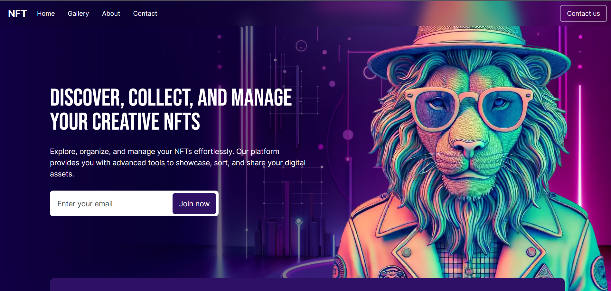

# NFT Gallery

[](https://shields.io/)



NFT Gallery is a web application built with Next.js that provides a platform for showcasing and exploring NFTs. It allows users to organize their NFTs into custom collections, view them in a modern "bookshelf" format, share them on an integrated social network, and protect their digital assets with robust security measures.

## Key Features

*   **Organization:** Organize your NFTs into custom collections and access them quickly.
*   **Visualization:** Enjoy a modern view and see the details of each NFT with a single click.
*   **Sharing:** Share your collections and discover those of other users on our integrated social network.
*   **Security:** Protect your digital assets with our robust security measures.

## Technologies Used

*   Next.js
*   React
*   TypeScript
*   Framer Motion
*   React Hook Form
*   React Icons
*   React Intersection Observer
*   Web3.js
*   Tailwind CSS

## Installation

To run this project locally, follow these steps:

1.  **Clone the repository:**

    ```bash
    git clone [https://github.com/and27/nft-gallery](https://github.com/and27/nft-gallery)
    ```

2.  **Navigate to the project directory:**

    ```bash
    cd nft-gallery
    ```

3.  **Install the dependencies:**

    ```bash
    npm install
    ```

## Usage

To start the development server:

```bash
npm run dev
```
Open http://localhost:3000 in your browser.


## Licencia

This project is under the MIT License. See the [LICENSE](LICENSE) file for details.
